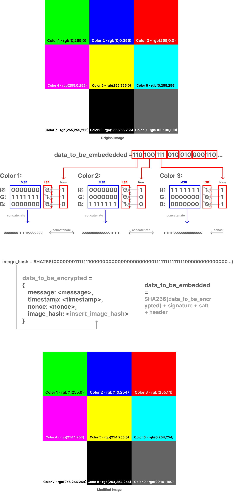

# Hidden in Plain Byte - P2P Encrypted Steganogaphy

  

This demo explores a potential method of secure communication which encrypts private messages and hides them within digital images using LSB steganography. It leverages Public Key Cryptography, ECDH Key Exchange, HKDF, Image Hashing, Digital Signature, and Padding to ensure the confidentiality, integrity, and authenticity of the hidden messages. This blend of cryptography and steganography provides a robust approach to protect data against unauthorized access while simultaneously hidden in plain sight.

### Key Features:

#### Public Key Cryptography:
Each user (Alice, Bob, and Charlie) has a pair of private and public keys. These keys are used for two purposes:
- **Signing messages:** The sender uses their private key to sign the encrypted message. This signature can be verified by the recipient using the sender's public key to ensure that the message was sent by the claimed sender.
- **Encrypting messages:** A shared secret key is derived using the sender's private key and the recipient's public key. This key is used to encrypt and decrypt the message.

#### Elliptic-Curve Diffie-Hellman (ECDH) Key Exchange:
The shared secret key is generated using ECDH key exchange, which ensures that even if an attacker knows the public keys of both the sender and recipient, they can't derive the shared key.

#### Hash-based Key Derivation Function (HKDF):
HKDF is used to derive the encryption key from the shared secret key. A random salt is generated for each message to ensure that the derived key is unique even if the shared key and the message are the same.

#### Hashing:
The SHA-256 hash of the original image (excluding the least significant bit of each pixel channel) is calculated and included in the message. This allows the recipient to verify that the image hasn't been modified after the data was embedded.

#### Digital Signature:
The sender signs the encrypted message using their private key. This allows the recipient to verify the authenticity of the sender and the integrity of the message.

#### Least Significant Bit (LSB) Steganography:
The encrypted message, the signature, and some metadata (like the lengths of the message, the signature, and the salt, and the salt itself) are embedded into the image using LSB steganography. This technique hides the data within the least significant bits of the pixel data, making it almost indistinguishable from the original image.

#### Padding:
Padding is added to the JSON data before encryption to ensure that the length of the data is a multiple of the block size of the cipher (AES in this case). The padding is removed after decryption.

  

## How it Works

### Encryption Page
When the sender wants to send a private message, they:

1. Choose an image to use as a carrier for the message.
2. The image’s bits excluding the least significant bits are hashed with SHA-256 and added to the data to be embedded into the image.
3. The Sender then enters a the message to be sent.
4. The system then encrypts this message, along with the other data to be embedded, using a derived key. The derived key is a combination of a shared key and a randomly generated salt. The shared key is generated using the sender's private key and the recipient's public key.
5. The sender then signs the encrypted data using their private key. This signature will be used by the recipient to verify the authenticity of the message.
6. The encrypted data, along with the salt and the sender's signature, is then embedded into the image using LSB (Least Significant Bit) steganography. This method of steganography alters the least significant bits of the image's pixel data to store the encrypted message, making the changes virtually indistinguishable to the human eye.
7. Once embedded, a modified image is created with a download button.

  

### Decryption Page
Upon receiving the image, the recipient:

1. Selects the received modified image for decryption.
2. The system then extracts the embedded data from the image. This includes the encrypted data, the salt, and the sender's signature.
3. The recipient's system verifies the sender's signature using the sender's public key. If the signature is valid, it confirms that the data is indeed from the sender and hasn't been tampered with during transmission.
4. The system then decrypts the data using a key derived from the shared key and the extracted salt. The shared key is generated using the recipient's private key and the sender's public key.
5. A hash is then taken of the bits of the modified image excluding the least significant bits and is compared with the hash that was embedded in the encrypted data. If both hashes match, then the recipient can verify that the image was not tampered with during transit.
6. Finally, the original plaintext message is displayed to the recipient.
This way, the system ensures secure communication between parties, with messages being confidential (only the intended recipient can decrypt and read the message) and authentic (the recipient can verify the sender of the message).

## Potential Weaknesses of this Demo
While this application uses robust cryptographic techniques, it is a conceptual demo and should only be used as such. With that said, here are some of the potential weaknesses of the demo:

* **Electronic Code Book (ECB):** ECB is one of the simplest and weakest types of encryption methods, but this can be easily substituted with a more advanced method of AES.
* **Encryption Key Security:** If the shared secret key from the ECC-based Diffie-Hellman exchange is compromised, an attacker could decrypt the hidden messages.
* **Image Transmission:** The image must be transmitted without any form of lossy compression (such as JPEG compression), which could remove or alter the hidden data, so for the time being this demo is focused on `.png` images.
* **Limited Message Size:** The length of the hidden message is limited by the size of the image. Large messages may require larger images.
* **Digital Signature Compromise:** If the sender's private key is compromised, an attacker could forge digital signatures.
* **Steganography Technique:** LSB Steganography is one of the less advanced forms of Steganography, there are some forms that may be better suited for this type of application.
* **RGB Channel:** While the Image hash function creates a hash of the image bits, excluding the least significant bits, of all three color channels Red, Green, and Blue, the encrypted data was only embedded in the Red Channel for this demo; however, this is a minor change that could allow for larger embedded files, which wasn't necessary for this demo. 

## Contact
- Author: **Preston Kirschner**
- Socials: [LinkedIn](https://www.linkedin.com/in/preston-kirschner/) | [Github](https://github.com/P-carth) | [Twitter](https://twitter.com/Prestonk_)
- Opensource project: [Huggingface](https://huggingface.co/spaces/P-carth/hidden_in_plain_byte-p2p_encrypted_steganography)
- I would love to hear your feedback (positive or negative)! Please reach out on one of the socials above if you have questions or comments.
